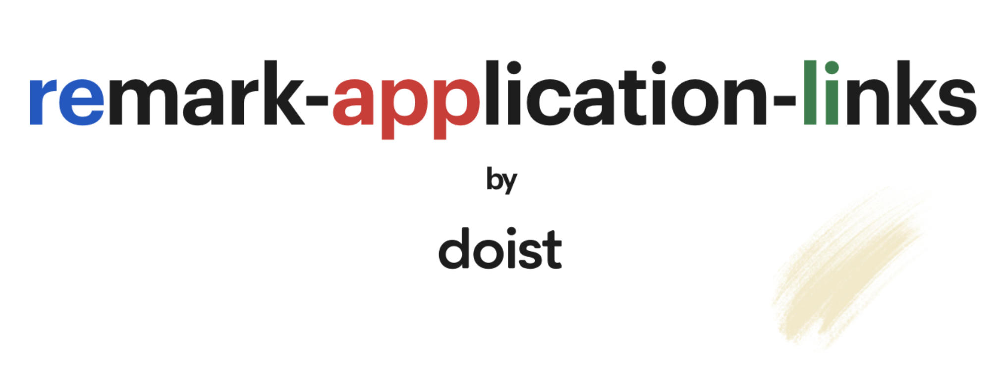

# remark-application-links

You want to allow your users to directly link deeply into their favorite applications like Notion or Mail. Per default remark only supports a handful of valid protocols when parsing links from text which makes this impossible. With the **remark-application-links** plugin you can support all the schemes and specify a block list of potentially dangerous ones.

Turn

```md
Here's a link to my notion: notion://notion.so/user/123
```

into

```html
<p>
    Here's a link to my notion:
    <a href="notion://notion.so/user/123">notion://notion.so/user/123</a>
</p>
```

Make sure you understand the security implications before using this plugin: [Security](#security)

Heavily inspired by [remark-linkify-regex](https://gitlab.com/staltz/remark-linkify-regex) but different enough to justify a separate plugin.

Bootstrapped and built with [tsdx](https://github.com/formium/tsdx).

## Installation

Use [npm](https://www.npmjs.com/get-npm) or [yarn](https://yarnpkg.com/lang/en/docs/install/) to install:

```sh
npm install @doist/remark-application-links
# or
yarn add @doist/remark-application-links
```

## Usage

This plugin exposes a function which you need to call with the blocked URL schemes (or with nothing to accept the default ones).

```js
remark().use(remarkApplicationLinksPlugin())
// or with custom schemes
remark().use(remarkApplicationLinksPlugin(['javascript', 'notion']))
```

## Security

Since this plugin is using a block list of URL schemes instead of explictly allowing explicit ones it potentially opens up your application for attackers. The general stance in the security community is that a complete block list is hard (read: impossible) to achieve. If you want to be on the safe side it's better to rely on an explicit allow list of supported URL schemes.

Per default we're blocking these url schemes:

```js
const blockedUrlSchemes = ['data', 'jar', 'java', 'javascript', 'vbscript', 'view-source']
```

In general it's recommended to not only rely on your parser to prevent inline script executions but apply a Content-Security Policy (CSP) on your page as reliable catch-all.

You're advised to thoroughly test your use cases to not open your users up to [cross-site scripting (XSS)](https://en.wikipedia.org/wiki/Cross-site_scripting) attacks. You might find additional tools like [rehype-sanitize](https://github.com/rehypejs/rehype-sanitize) helpful.

### Markdown links and react-markdown

This plugin will transform this text:

```md
[link](<javascript:alert(1)>)
```

into

```html
<p><a href="javascript:alert(1)">link</a></p>
```

Which is dangerous as it would execute JavaScript. If you allow users to enter the text this will open you up to cross-site scripting (XSS) attacks. As mentioned above a strong CSP will protect you from this and not allow the JavaScript to execute.

This plugin can be used in combination with [react-markdown](https://github.com/rexxars/react-markdown). In order to prevent the example above being parsed as a link you need to supply the `transformLinkUri` prop.

## Changelog

We're maintaining a [changelog](./CHANGELOG.md) in this repository. Our versioning follows [semantic versioning](https://semver.org/).

## Contributing

Contributions are welcome. Check our [contributing guide](./CONTRIBUTING.md).

## License

This project is distributed under the [MIT License](./LICENSE).
